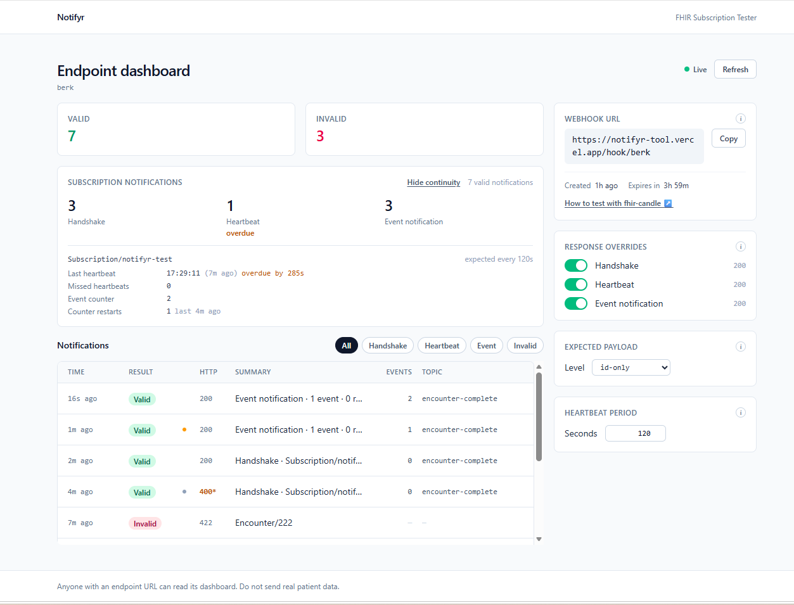
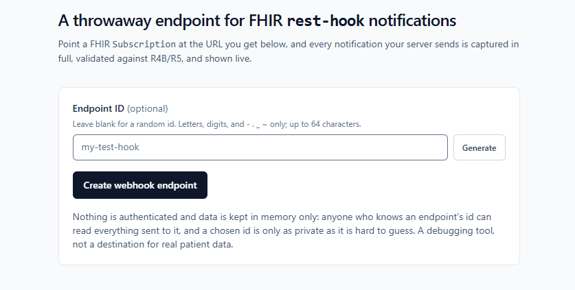

<h1 align="center">Notifyr</h1>

<p align="center">
  A disposable webhook endpoint for testing FHIR <code>Subscription</code>
  <code>rest-hook</code> notifications — captured, validated and shown live.
</p>

<p align="center">
  <a href="https://github.com/berkant-k/notifyr/actions/workflows/ci.yml"></a>
  <a href="LICENSE"></a>
  
  
</p>

<p align="center">
  
</p>

<p align="center">
  <em>A live dashboard during the fhir-candle walkthrough — one handshake, six<br>
  heartbeats, two event-notifications, and one payload that failed validation.</em>
</p>

---

## Why

Testing a `rest-hook` subscription normally means standing up a publicly
reachable server just to find out what your FHIR server is actually sending.
Notifyr replaces that with a URL you create in one click.

Point a `Subscription` at it, and every request that arrives is:

- **Captured in full** — the raw body exactly as sent, even when it is
  malformed, because an unparseable payload is the one you most need to see.
- **Validated** — JSON, then FHIR structure and value sets, with every problem
  located (`Patient.gender`), explained, and — for the rules Notifyr applies
  itself — linked to the paragraph of the spec or Backport IG it came from, so a
  disagreement about a payload is settled by reading rather than by trusting
  this tool.
- **Counted by type** — handshakes, heartbeats and event-notifications tallied
  separately, so you can confirm each stage of the subscription lifecycle fired.
- **Checked for what never arrived** — an event counter that jumps from 7 to 11
  is three notifications you never received; a heartbeat that never comes is a
  channel that has gone quiet. Both are reported and tallied, and nothing else
  in the pipeline can see a message that was never sent.
- **Shown live** — the dashboard updates in about a second, no refresh.
- **Answerable with an error** — switch handshake, heartbeat or
  event-notification off to reply 500 (or any status you pick) instead of 200,
  and watch how your server retries or gives up.

Handshake and heartbeat notifications are first-class: `SubscriptionStatus`
arrived in FHIR **R4B**, and most JS validators only know R4, so they reject
every handshake outright. Notifyr validates them properly. See
[docs/DESIGN.md](docs/DESIGN.md#subscription-notifications).

## Quick start

```bash
git clone https://github.com/berkant-k/notifyr.git
cd notifyr
npm install
npm run dev        # http://localhost:3000
```

Open the home page, optionally type an endpoint id (or leave it blank for a
random one), and click **Create webhook endpoint**. You land on its dashboard.



Then send it something:

```bash
curl -X POST http://localhost:3000/hook/<your-id> \
  -H 'content-type: application/fhir+json' \
  -d '{"resourceType":"Patient","id":"example","gender":"male"}'
```

The message appears on the dashboard within a couple of seconds. Click it for
the raw body, request headers and validation results.

> **Deploying?** Storage is in-memory, which behaves badly on serverless
> platforms, and there is no authentication. Read
> [Security and limitations](#security-and-limitations) first, and
> [docs/PUBLISHING.md](docs/PUBLISHING.md) for what a public instance needs.

## Walkthrough: a real subscription with fhir-candle

[fhir-candle](https://github.com/FHIR/fhir-candle) is a small in-memory FHIR
server with a Subscriptions reference implementation — the quickest way to see
genuine notifications arrive. The same walkthrough is built into the app, on the
home page and on any empty dashboard, where the sample below is pre-filled with
that endpoint's own URL.

**1. Start fhir-candle:**

```bash
fhir-candle --reference-implementation subscriptions -o
```

It serves R4B at `http://localhost:5826/fhir/r4b`; `-o` opens its UI.

**2. Create a Subscription** pointing at your hook —
`PUT http://localhost:5826/fhir/r4b/Subscription/notifyr-test`:

```json
{
  "resourceType": "Subscription",
  "id": "notifyr-test",
  "status": "active",
  "end": "2027-01-01T00:00:00Z",
  "reason": "Testing rest-hook notifications with Notifyr",
  "criteria": "http://example.org/FHIR/SubscriptionTopic/encounter-complete",
  "_criteria": {
    "extension": [
      {
        "url": "http://hl7.org/fhir/uv/subscriptions-backport/StructureDefinition/backport-filter-criteria",
        "valueString": "Encounter?patient=Patient/example"
      }
    ]
  },
  "channel": {
    "extension": [
      {
        "url": "http://hl7.org/fhir/uv/subscriptions-backport/StructureDefinition/backport-heartbeat-period",
        "valueInteger": 120
      }
    ],
    "type": "rest-hook",
    "endpoint": "http://localhost:3000/hook/your-hook-id",
    "payload": "application/fhir+json",
    "_payload": {
      "extension": [
        {
          "url": "http://hl7.org/fhir/uv/subscriptions-backport/StructureDefinition/backport-payload-content",
          "valueCode": "id-only"
        }
      ]
    }
  }
}
```

The heartbeat extension is 120 seconds, so a heartbeat arrives every two
minutes. Keep `end` in the future or the subscription expires.

**3. Watch the handshake arrive.** As soon as the Subscription goes active,
fhir-candle sends a handshake and the Handshake counter reads 1. If it does not,
the server could not reach your URL.

**4. Create an Encounter** with `"status": "active"` —
`PUT http://localhost:5826/fhir/r4b/Encounter/example`:

```json
{
  "resourceType": "Encounter",
  "id": "example",
  "status": "active",
  "class": {
    "system": "http://terminology.hl7.org/CodeSystem/v3-ActCode",
    "code": "IMP",
    "display": "inpatient encounter"
  },
  "subject": { "reference": "Patient/example" }
}
```

Nothing is notified yet — the topic fires on completion, not creation.

**5. Update it to `"status": "finished"`.** That satisfies the
`encounter-complete` topic and triggers an event-notification.

You end up with a handshake, an event-notification, and a heartbeat every two
minutes for as long as the subscription stays active.

## Validation

Three tiers, each gating the next:

| Tier | Check | On failure |
| --- | --- | --- |
| 1 | Body parses as JSON | `400` |
| 2 | It is an object with a `resourceType` | `422` |
| 3 | Passes [`fhir`](https://www.npmjs.com/package/fhir) R4 structural and value-set validation | `422` |

Warnings — a `Content-Type` that is not `application/fhir+json`, a notification
`Bundle` that is not `history` — are shown but never make a message invalid.

Subscription notifications get dedicated handling, because the R4-only validator
cannot see `SubscriptionStatus` at all. Full detail, including the exact error
and warning rules, is in [docs/DESIGN.md](docs/DESIGN.md#subscription-notifications).

What is validated, what is only partly validated and what is not covered yet is
tracked rule by rule in [docs/VALIDATION.md](docs/VALIDATION.md), traced to the
[Subscriptions R5 Backport IG](https://hl7.org/fhir/uv/subscriptions-backport/).

## API

| Route | Method | Purpose |
| --- | --- | --- |
| `/api/endpoints` | `POST` | Create an endpoint. Optional body `{"id":"my-hook"}`; anything else gets a random id. `201` with `{ id, url }`, `400` on a malformed id, `409` if taken. |
| `/api/endpoints/:id/messages` | `GET` | Counters plus the 10 most recent messages. `?since=<version>` returns `{changed:false}` when nothing is new. `404` if unknown. |
| `/api/endpoints/:id/response-rules` | `PUT` | Set per-type response overrides. Partial body, e.g. `{"handshake":{"enabled":false,"status":500}}`. `400` on a bad status, `404` if unknown. |
| `/api/endpoints/:id/payload-content` | `PUT` | Set the expected payload level. Body `{"expectedPayloadContent":"id-only"}`, or null to unset. `400` on an unknown level, `404` if unknown. |
| `/api/endpoints/:id/heartbeat-period` | `PUT` | Set the expected heartbeat period, in seconds. Body `{"heartbeatPeriodSeconds":120}`, or 0 to switch the check off. Defaults to 120. `400` outside 5-86400, `404` if unknown. |
| `/hook/:id` | `POST` | Webhook receiver. `200` valid, `400` unparseable, `422` invalid FHIR, `404` unknown endpoint, `413` body over 1 MB — unless a response override is in force. |

**Endpoint ids** may be chosen or random. Because an id becomes a URL path
segment, it accepts the URL-unreserved set only — letters, digits and `- . _ ~`,
up to 64 characters. A taken id returns `409` rather than joining the existing
endpoint, so nobody can read a stranger's traffic by guessing its name.

## Testing failure paths

A receiver that always answers 200 only exercises the happy path. The dashboard
has a switch per notification type — handshake, heartbeat and event-notification
— and switching one off makes Notifyr answer an error status instead:

```bash
curl -X PUT http://localhost:3000/api/endpoints/$ID/response-rules \
  -H 'content-type: application/json' \
  -d '{"handshake":{"enabled":false,"status":500}}'
```

The suggested status is `400`, and any whole number from `201` to `599` works
(`200` is what the switch being on already means). Switch it back on and the
endpoint answers normally again.

**The notification is still received, validated, stored and counted.** Only the
status on the wire changes — the point is to watch the sender react to a
rejection, not to hide the notification from you. Rows answered this way are
marked with `*` in the HTTP column so a forced 400 on a valid handshake does not
read as a bug.

## Checking the payload level

A `Subscription` says how much content its notifications carry —
`empty`, `id-only` or `full-resource` — and a receiver never sees the
Subscription. Tell Notifyr which level you configured, using the **Expected
payload** select on the dashboard or the API:

```bash
curl -X PUT http://localhost:3000/api/endpoints/$ID/payload-content \
  -H 'content-type: application/json' \
  -d '{"expectedPayloadContent":"id-only"}'
```

Event-notifications are then checked against that level exactly: an `id-only`
notification that ships whole resources, or a `full-resource` one that ships
none, is named as such. Left unset, notifications are still checked for
internal consistency — one that carries resource content while naming no focus
resources matches no payload level at all.

Mismatches are **warnings**. They mean the sender and your expectation
disagree, which is as often a mistyped expectation as a server bug, so they
never change whether a notification counts as valid. Each stored notification
records the level it was judged against, since changing the select does not
re-grade what has already arrived.

## Stream continuity

Everything above judges the bytes of a request that arrived. Two failures show
up only in what *didn't*, so Notifyr tracks them across notifications:

- **Missed events.** Every notification carries
  `eventsSinceSubscriptionStart` — heartbeats included, which is what makes a
  quiet stream measurable. A counter that jumps from 7 to 11 means three
  notifications never reached you: the arriving message is warned and the three
  are added to a cumulative tally. A counter that goes *backwards* is a
  recreated Subscription rather than a loss, so it is recorded as a restart and
  the sequence simply resumes from there.
- **Late heartbeats.** Tell Notifyr the period you configured — the
  **Heartbeat period** card, or the API below; it defaults to 120 seconds, and
  `0` switches the check off:

  ```bash
  curl -X PUT http://localhost:3000/api/endpoints/$ID/heartbeat-period \
    -H 'content-type: application/json' \
    -d '{"heartbeatPeriodSeconds":120}'
  ```

  A heartbeat arriving past 1.5× that period (or the period plus 5 seconds,
  whichever is later — schedulers jitter, and a check that fires at 121s gets
  switched off within the minute) is warned and counted. A subscription that has
  gone silent is shown as overdue on the dashboard without waiting for anything
  to arrive.

Both are tracked per `SubscriptionStatus.subscription.reference`, not per
endpoint, because one endpoint may serve several Subscriptions and each counts
its own events — interleaving two of them would otherwise read as a permanent
gap on a system where nothing is wrong.

Like the payload-level checks these are **warnings**: they describe the stream,
not the message in hand, and never make a notification invalid. The rules and
the reasoning are in [docs/CONTINUITY.md](docs/CONTINUITY.md).

## Security and limitations

Notifyr is a debugging tool. Please read this before pointing anything real at
it, and see [SECURITY.md](SECURITY.md) for reporting.

- **No authentication.** Anyone who knows an endpoint id can read everything
  sent to it, via the dashboard or the API.
- **Chosen ids are guessable.** A random UUID is not worth guessing; `test` or
  `demo` are. Prefer a random id for anything you would rather others not see.
- **Request headers are stored and shown in full, `Authorization` included.**
  Seeing the credential your server actually sent is the point; the cost is that
  a dashboard URL is equivalent to the credentials it displays.
- **Do not send real patient data.**
- **In-memory storage does not survive serverless.** Each instance has its own
  module scope, so a notification handled by one instance is invisible to a
  dashboard poll served by another, and everything is lost on cold start. Fine
  locally; a real deployment needs a shared store first. `MessageStore` in
  `src/lib/store.ts` is the seam — every method is already async.
- **No rate limiting yet.**
- **Retention:** 100 messages per endpoint (10 shown), 500 endpoints, 1 MB body
  cap. Counters are cumulative and unaffected by trimming.

## Development

```bash
npm run dev         # dev server
npm test            # vitest, single run
npm run test:watch
npm run lint
npm run typecheck
npm run build
```

Requires Node >= 20.9 (Next.js 16). CI runs lint, typecheck, test and build on
Node 20.x and 22.x for every push and pull request.

**288 tests across nine suites**, all against the real code with no dev server
and no network — `tests/api.test.ts` imports the App Router handlers directly
and calls them with plain `Request` objects.

Architecture, design decisions and the project layout live in
[docs/DESIGN.md](docs/DESIGN.md).

## Contributing

Contributions are welcome. See [CONTRIBUTING.md](CONTRIBUTING.md) for the
workflow and [CODE_OF_CONDUCT.md](CODE_OF_CONDUCT.md) for expectations.

Good places to start are listed in
[docs/DESIGN.md](docs/DESIGN.md#where-help-is-most-useful) — the shared-storage
backend and the R4 backport notification format are the two biggest gaps.

## References

Every link below was checked against the live page. Note that
`hl7.org/fhir/R4B/subscriptions.html` does **not** exist — R4B documents the
mechanism on the Subscription resource page instead.

| Reference | Covers |
| --- | --- |
| [Subscription (R4B)](https://hl7.org/fhir/R4B/subscription.html) | The resource, plus the Channels section defining `rest-hook` delivery |
| [SubscriptionStatus (R4B)](https://hl7.org/fhir/R4B/subscriptionstatus.html) | What every notification carries; `type` is 1..1, `eventsSinceSubscriptionStart` a string |
| [SubscriptionTopic (R4B)](https://hl7.org/fhir/R4B/subscriptiontopic.html) | Which events trigger a notification and what the payload contains |
| [Topic-Based Subscriptions Framework (R5)](https://hl7.org/fhir/R5/subscriptions.html) | The full framework; R5 types `eventsSinceSubscriptionStart` as `integer64` |
| [Subscriptions R5 Backport IG](https://hl7.org/fhir/uv/subscriptions-backport/) | How R4 servers implement the R5 model; source of the `backport-*` extensions |
| [Errors and recovery (Backport IG)](https://hl7.org/fhir/uv/subscriptions-backport/errors.html) | Spotting lost notifications from event counters, and silence from heartbeats |
| [fhir-candle](https://github.com/FHIR/fhir-candle) | The reference server used in the walkthrough |
| [fhir (npm)](https://www.npmjs.com/package/fhir) | The R4 validator Notifyr runs payloads through |

## License

[MIT](LICENSE) © Berkant Karduman
